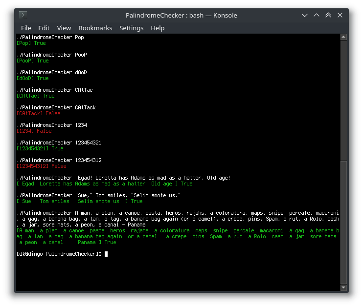

# PalindromeChecker

This is an efficient palindrome checker written in C, using a command-line interface. 

It is case-insensitive and ignores any non-English characters as well as non-numbers.

## How to Install

Install by using the "make" command inside the main repository folder.

Uninstall by using "make clean".

## How to Run

    ./PalindromeChecker [Word that has to be checked]
    
If you want to check a string, put it between quotation marks.

